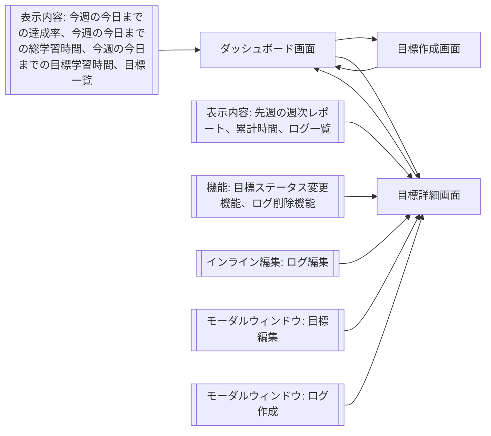

## アプリ名
LogLift（ログリフト）

## アプリ概要
目標設定を行い、日々の学習ログを蓄積。AIがデータ分析し、Keepを重視したKPT法(Keep/Problem/Try)で目標ごとに週次レポートを作成する。

## ペルソナ
学んでいるが、成長を実感できずに不安になる人

## 機能
- 目標設定のCRUD機能
	- タイトル
	- 学習内容
	- 目標値（週○分）
	- 開始日
	- 終了日
	- ステータス
- 学習ログのCRUD機能
	- 目標ID
	- 学習日
	- 学習時間
	- 学習結果
	- 感想
- 週次レポート作成(ロジック)
	- 先週の学習時間（月曜始まりで固定）
	- 累計学習時間
	- 週次目標達成率　先週の学習時間/目標値
- 週次レポート作成(AI)
	- 進捗評価(AIによる総評)
	- Keep(良かった点)
	- Try(挑戦)

### 初期段階で実装しない機能
週次レポート作成(AI)

## 画面遷移図

## 画面一覧
|画面名|表示内容|
|-|-|
|ダッシュボード画面|上段: 今週の今日までの達成率 中段: 今週の今日までの総学習時間(分) + 今週の今日までの目標学習時間(分) 下段目標一覧|
|目標作成画面||
|目標詳細画面|上段: 先週のレポート ※右上に目標アーカイブボタン 中段: 累計時間 下段: ログ作成ボタン、ログ一覧(ログ削除ボタン)|

データに影響する部分は、「目標作成・編集・アーカイブ」「ログ作成・編集・削除」「全体の達成率、今週の総学習時間」「先週のレポート、目標毎の累計時間」

## テーブル設計
### goalsテーブル
目標情報を管理するテーブル

|Column|Type|Nullable|Default|Description|
|-|-|-|-|-|
|id|bigint|No|GENERATED ALWAYS AS IDENTITY||
|name|varchar(100)|No||目標名|
|description|text|Yes||説明|
|weekly_target_minutes|integer|No||目標値(週○分)|
|start_date|date|No||開始日|
|end_date|date|No||終了日|
|status|integer|No|0|0: アクティブ 1: クローズ 2: アーカイブ|
|created_at|timestamptz|No|CURRENT_TIMESTAMP|作成日時|
|updated_at|timestamptz|No|CURRENT_TIMESTAMP|更新日時|

#### INDEX / CONSTRAINT
PRIMARY KEY (id)
CONSTRAINT chk_goals_date
CHECK (end_date >= start_date)
CONSTRAINT chk_weekly_target_positive
CHECK (weekly_target_minutes > 0)
CONSTRAINT chk_goals_status
CHECK (status IN (0,1,2))

#### 仕様
- 更新日時はDBトリガーで自動更新
- アーカイブ削除なので、物理削除は行わない
- アーカイブ削除は手動で行う
- 終了日の翌月曜日に週次レポート作成後、ステータスを「クローズ」に自動更新する
- 同名タイトルは許可
- 下記制御は、アプリケーション層で行う
	- ステータスがクローズの場合、学習ログ登録および更新不可

### learning_logsテーブル
学習ログを管理するテーブル

|Column|Type|Nullable|Default|Description|
|-|-|-|-|-|
|id|bigint|No|GENERATED ALWAYS AS IDENTITY||
|goal_id|bigint|No|||
|study_date|date|No||学習日|
|study_minutes|integer|No||学習時間(分)|
|result|text|Yes||学習結果|
|reflection|text|Yes||感想|
|created_at|timestamptz|No|CURRENT_TIMESTAMP|作成日時|
|updated_at|timestamptz|No|CURRENT_TIMESTAMP|更新日時|

#### INDEX / CONSTRAINT
PRIMARY KEY (id)
INDEX (goal_id, study_date)
FOREIGN KEY (goal_id)
REFERENCES goals(id)
ON DELETE RESTRICT
CONSTRAINT chk_study_minutes_positive
CHECK (study_minutes > 0)

#### 仕様
- 更新日時はDBトリガーで自動更新
- 下記制御は、アプリケーション層で行う
	- 目標の開始日よりも過去日のログ登録は不可
	- 目標の終了日よりも未来日のログ登録は不可

### weekly_reportsテーブル
週次レポートを管理するテーブル

|Column|Type|Nullable|Default|Description|
|-|-|-|-|-|
|id|bigint|No|GENERATED ALWAYS AS IDENTITY||
|goal_id|bigint|No|||
|issue_date|date|No||レポート発行日|
|period_start_date|date|No||集計開始日|
|period_end_date|date|No||集計終了日|
|weekly_study_minutes|integer|No||累計学習時間|
|target_minutes|integer|No||目標値|
|achievement_rate|numeric(5,1)|No||週次目標達成率（%）|
|ai_summary|text|Yes||総評|
|ai_keep|text|Yes||Keep（良かった点）|
|ai_try|text|Yes||Try（挑戦）|
|created_at|timestamptz|No|CURRENT_TIMESTAMP|作成日時|
|updated_at|timestamptz|No|CURRENT_TIMESTAMP|更新日時|

#### INDEX / CONSTRAINT
PRIMARY KEY (id)
UNIQUE (goal_id, period_start_date)
FOREIGN KEY (goal_id)
REFERENCES goals(id)
ON DELETE RESTRICT
CHECK (achievement_rate >= 0)

#### 仕様
- 週次レポートはスナップショットとして扱う
- レポート作成時点の目標値を保存する
- 週次達成率は小数点第一位を四捨五入する
- 週次達成率は0以上とする
- 更新日時はDBトリガーで自動更新
- 下記制御は、アプリケーション層で行う
	- 週次レポートの作成は、毎週月曜日に行う
	- 週次レポートの再発行は行わない
	- 週次レポート作成日（月曜日）を発行日とする
	- 集計開始日は発行日の7日前とする
	- 集計終了日は発行日の1日前とする
	- レポート作成対象は「アクティブ」かつ「終了日を含む週」までとする
	- 目標終了日よりも週開始日が未来日の場合、週次レポートを作成しない
		- 目標終了日が月曜日以外の場合、月曜日から目標終了日のレポートを作成する
		- 目標終了日が月曜日以外の場合、週次目標達成率は日割り計算する
		- 集計終了日は目標終了日を超えない
	- 目標のステータスがクローズの場合、週次レポートを作成しない
